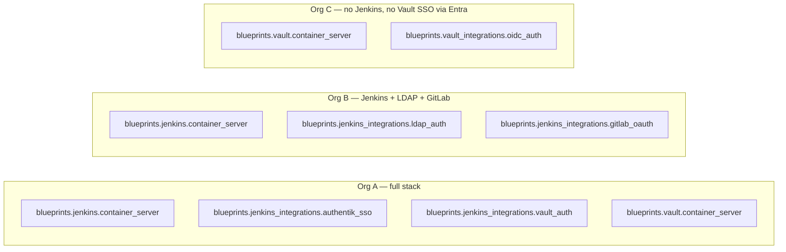

# Blueprints Example Consumer Platforms

**Status:** Active
**Date:** 06 June 2026
**Owner:** Platform Engineering

A *platform* is owned by a consuming organisation. It is the **only** place composition happens
(Principle 5). The scaffolds live under [`platforms/`](../../platforms/). These map directly to the
"each org picks a menu" examples.

---

## Composition model



Same component collections, different menus — and no component knows which menu it is in.

---

## `platform-ci`

Jenkins + job_dsl + Authentik SSO + Vault auth. Secrets resolved at the platform layer via
`community.hashi_vault` and passed into roles as variables (LADR-003).

```
platforms/platform-ci/
  requirements.yml      # blueprints.jenkins, blueprints.jenkins_integrations,
                        # blueprints.common, community.hashi_vault  (all pinned)
  inventory/hosts.yml
  group_vars/all.yml    # org-specific values (hostnames, ports, Vault addr/role)
  site.yml              # composes the roles via include_role
```

`site.yml` sketch:

```yaml
- hosts: ci
  become: true
  pre_tasks:
    - name: Resolve Jenkins admin token from Vault (platform layer)
      ansible.builtin.set_fact:
        jenkins_server_admin_token: >-
          {{ lookup('community.hashi_vault.vault_kv2_get',
                    'platform/ci/jenkins', engine_mount_point='kv',
                    url=platform_vault_addr, auth_method='approle',
                    role_id=platform_vault_role_id,
                    secret_id=platform_vault_secret_id).secret.admin_token }}
      no_log: true
  roles:
    - blueprints.jenkins.container_server
    - blueprints.jenkins.job_dsl
    - blueprints.jenkins_integrations.authentik_sso
    - blueprints.jenkins_integrations.vault_auth
```

---

## `platform-monitoring`

Graylog server + inputs + pipelines. No Jenkins, no Vault required.

```
platforms/platform-monitoring/
  requirements.yml      # blueprints.graylog, blueprints.common
  inventory/hosts.yml
  group_vars/all.yml
  site.yml
```

---

## `platform-identity`

Vault server + OIDC auth backend wiring (e.g. against the org's IdP).

```
platforms/platform-identity/
  requirements.yml      # blueprints.vault, blueprints.vault_integrations, blueprints.common
  inventory/hosts.yml
  group_vars/all.yml
  site.yml
```

---

## Key takeaways

- The org chooses collections in `requirements.yml` (pinned versions).
- The org supplies all org-specific values and secrets as variables.
- Adding a capability later = add a role + its variables; no unrelated component changes.

---

## Related

- [BLUEPRINTS_EXAMPLE_COLLECTIONS.md](BLUEPRINTS_EXAMPLE_COLLECTIONS.md)
- [../standards/BLUEPRINTS_SECRET_CONSUMPTION.md](../standards/BLUEPRINTS_SECRET_CONSUMPTION.md)
- [BLUEPRINTS_DESIGN_PRINCIPLES.md](BLUEPRINTS_DESIGN_PRINCIPLES.md) §5
