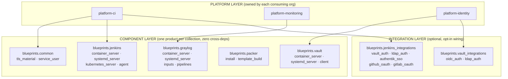
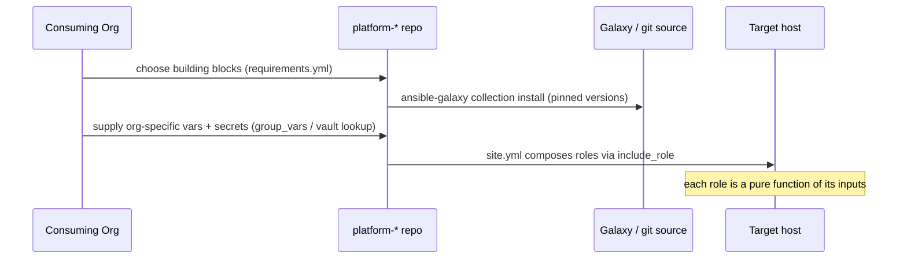

# Blueprints Framework Architecture

**Status:** Active
**Date:** 06 June 2026
**Owner:** Platform Engineering

---

## 1. Problem statement

Multiple unrelated organisations need to build enterprise platforms from similar parts, but each
picks a *different* subset and matures at a different pace:

| | Org A | Org B | Org C |
|---|---|---|---|
| CI | Jenkins | Jenkins | GitHub Actions |
| Secrets | Vault | — | Vault |
| Identity | Keycloak | LDAP | Entra ID |
| SCM | — | GitLab | — |

A single monolithic automation product cannot serve these combinations: it would force every org to
carry technologies it does not use, and an upgrade to one product would ripple into unrelated ones.

The `blueprints.*` framework solves this with **composable, independently-versioned building
blocks**. Each org assembles only the blocks it wants and adds more as it matures — without any
block assuming the others exist (see [BLUEPRINTS_DESIGN_PRINCIPLES.md](BLUEPRINTS_DESIGN_PRINCIPLES.md)).

---

## 2. Three layers

**Reading the diagram:**

- **Component layer** — one collection per product. Collections never point at each other. A clean
  host plus the right variables is all a component role needs.
- **Integration layer** — optional collections that wire two already-existing products together
  (e.g. "make this Jenkins authenticate against that Authentik"). Opt-in only.
- **Platform layer** — owned by the consuming organisation. This is the **only** place where
  composition happens: the org lists exactly the component and integration roles it wants.

The deliberate absence of arrows between component collections is the architecture: dependencies
flow **downward from platforms**, never **sideways between components**.

---

## 3. How an organisation consumes the framework

1. The org creates a `platform-*` repo and lists the collections it wants in `requirements.yml`,
   **pinned** to specific versions.
2. It supplies org-specific configuration and secrets as variables (secrets fetched controller-side
   and passed in — never fetched by the roles).
3. `site.yml` composes the chosen roles. Adding a capability later = adding a role + its variables;
   it never forces a change to an unrelated component.

See [BLUEPRINTS_EXAMPLE_PLATFORMS.md](BLUEPRINTS_EXAMPLE_PLATFORMS.md) for worked Org A/B/C examples.

---

## 4. Independent versioning & blast radius

Each collection is released and versioned independently (semver). A Vault upgrade never forces a
Jenkins upgrade. Consumers pin versions and adopt new releases on their own schedule. See
[../standards/BLUEPRINTS_RELEASE_STRATEGY.md](../standards/BLUEPRINTS_RELEASE_STRATEGY.md).

---

## 5. Scope boundaries

**In scope:** reusable, org-agnostic component + integration collections; the platform composition
pattern; testing/release/publishing standards.

**Out of scope:** any single organisation's concrete platform (those live in that org's own
`platform-*` repos); org-specific hostnames, secret paths, or identity issuers (those are variables
supplied by consumers, never shipped in the framework).

---

## Related

- [BLUEPRINTS_DESIGN_PRINCIPLES.md](BLUEPRINTS_DESIGN_PRINCIPLES.md)
- [../standards/BLUEPRINTS_COLLECTION_STRUCTURE.md](../standards/BLUEPRINTS_COLLECTION_STRUCTURE.md)
- [../decisions/LADR-001-blueprints-composable-collections.md](../decisions/LADR-001-blueprints-composable-collections.md)
