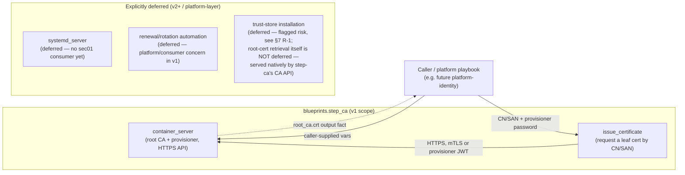
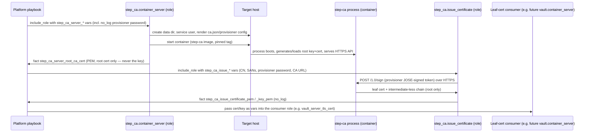
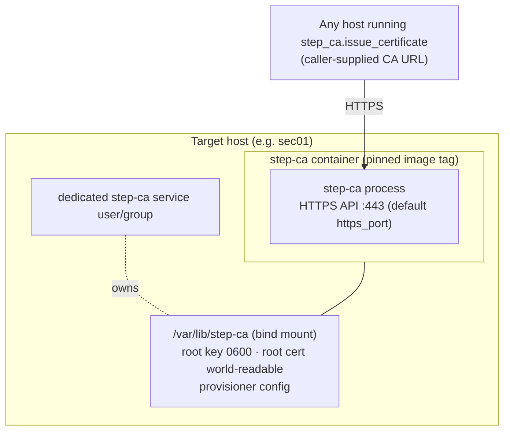
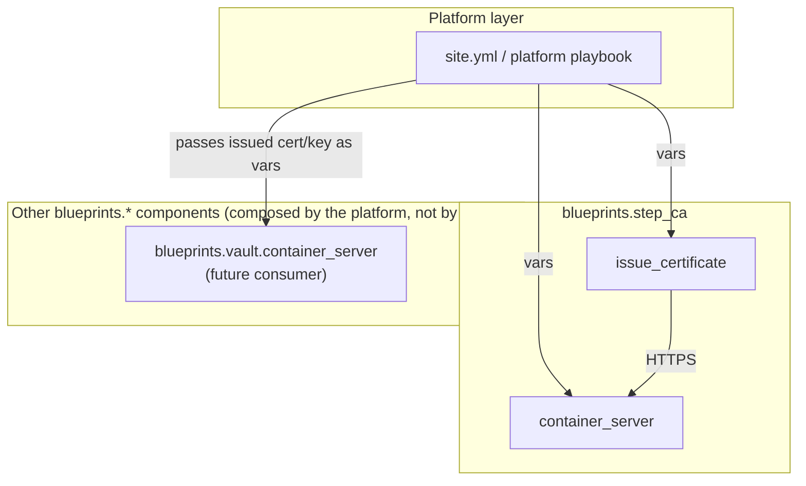
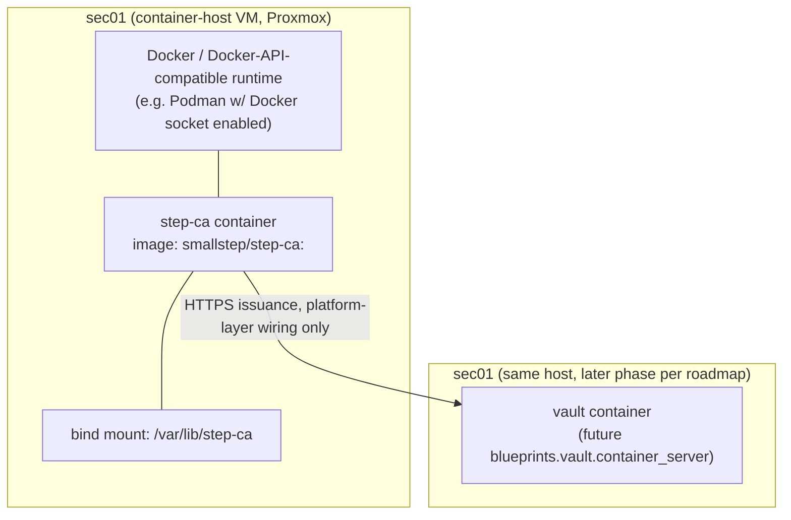

# Blueprints Step-CA Single-Tier PKI Design

**Status:** Draft
**Date:** 27 June 2026
**Owner:** Platform Engineering

---

## 1. Problem statement

`iac-foundry` has no internal-PKI building block. Phase 3 (`sec01`) of the Vernify homelab roadmap
is blocked on exactly this gap: `step-ca` must exist and be able to issue TLS certificates *before*
`blueprints.vault.container_server` can be filled in, because step-ca is the trust anchor that signs
the certificate Vault serves over TLS (`HOMELAB_GREENFIELD_BOOTSTRAP.md` Phase 3, step 2). Today the
roadmap lists this as a flat **GAP**.

This design adds `blueprints.step_ca` — a new, org-neutral component collection (repo
`ansible-collection-step-ca`) that stands up [Smallstep `step-ca`](https://smallstep.com/docs/step-ca/)
as a **single-tier (root-only)** internal CA and exposes a provisioner capable of issuing leaf TLS
certificates on request, with no Vernify-specific wiring and no dependency on any other
`blueprints.*` collection. It must satisfy the same litmus test every other component collection
satisfies: it converges on a clean host given only its own caller-supplied variables
(`BLUEPRINTS_DESIGN_PRINCIPLES.md`, "The litmus test").

The single-tier (no intermediate CA) architectural model is **confirmed and non-negotiable** per the
approved Stage 1 requirements — it is not re-litigated here, only justified and bounded (see
[LADR-004](../decisions/LADR-004-step-ca-single-tier-pki.md)).

Why now: this is the **last unresolved GAP** standing between the current `blueprints.*` catalogue
(`vault`, `jenkins`, `graylog`, `common`) and an unblocked Phase 3. Without it, `sec01` cannot stand
up Vault with real TLS, which cascades into blocking Phase 4 (`build01`/Jenkins) and Phase 5
(`agent01`), both of which also consume step-ca-issued certificates per the roadmap.

---

## 2. Target state / architecture

### 2.1 Scope at a glance



Two roles ship in v1: `container_server` (stand up the root CA + provisioner) and
`issue_certificate` (request a leaf cert from a running instance). Both are pure functions of
caller-supplied variables; neither imports another `blueprints.*` collection
(`galaxy.yml` → `dependencies: {}`).

### 2.2 Component interactions



The platform layer is the **only** place that wires `step_ca.issue_certificate` output into another
component's TLS input variables — `blueprints.step_ca` never reaches into another collection's
variable space, and never invokes another collection's role (Design Principles §1, §5).

### 2.3 Component descriptions

#### Component: `container_server` role
- **Purpose:** Initialize a single-tier step-ca root CA and run it as a container, exposing the
  CA's HTTPS API and at least one authorized provisioner.
- **Technology:** `smallstep/step-ca` container image (pinned tag, see §6 Decision 2), driven via
  `community.docker` modules — the technology choice this collection's `container_server` would
  establish for the framework, not one it inherits from a working sibling (see §2.3 Rationale and
  Appendix B for the correction of an earlier, inaccurate "matches existing convention" claim:
  `vault.container_server` is currently an `assert`+`debug` scaffold with no `community.docker` usage).
- **Responsibilities:**
  - Render `ca.json` (step-ca's own config format) from caller-supplied variables.
  - Generate a new root key/cert pair **or** accept a caller-supplied root key/cert pair (FR-1).
  - Configure exactly one default provisioner type (JWK, password-protected) from a caller-supplied
    secret; supports adding caller-declared additional provisioners via a typed list (FR-2).
  - Create/own a dedicated service user and a data directory with restrictive permissions.
  - Start/restart the container; expose the root cert (not the key) as an Ansible fact/output for
    the platform layer to consume or write to disk.
  - **Root-cert retrieval for consumer bootstrap is already satisfied by step-ca itself, with no
    additional code in this role:** step-ca's CA API natively serves the root certificate set at
    unauthenticated, well-known endpoints (`GET /roots`, `GET /roots.pem`, `GET /root/:fingerprint`)
    on the same HTTPS port `container_server` already stands up for FR-3 issuance — the root
    certificate is a public artifact, not a secret, so no auth gate is needed or added. The standard
    `step ca bootstrap --ca-url <url> --fingerprint <fp>` client flow consumes this directly (TOFU:
    the fingerprint, not blind trust of the CA's serving TLS cert, establishes first-contact trust).
    This role's only obligation toward that flow is to expose the CA fingerprint alongside the root
    cert fact/output (§7 Risk R-1) so a platform layer can pass it to consumers out-of-band; the
    fingerprint, like the root cert, is not sensitive and needs no `no_log`.
- **Dependencies:** None on other `blueprints.*` collections. Requires Docker, or a
  Docker-API-compatible runtime (e.g. Podman with its Docker-compatible socket explicitly enabled),
  to already be present on the host — see assumption A-2 for the precise scope of this requirement.
  Native Podman without the Docker-compatibility shim is unverified and out of scope for v1.
  Provisioning the runtime itself is out of scope, consistent with existing sibling roles' assumption
  that a container runtime precedes them.
- **Rationale:** Container packaging establishes the pattern other scaffolded siblings will likely
  follow — note this is a forward-looking framing, not an existing-precedent claim:
  `vault.container_server` as it exists today is itself only an `assert`+`debug` scaffold (its own
  task explicitly labeled "Scaffold convergence placeholder," with no `community.docker` module call
  or any real container lifecycle code), so it cannot be cited as working precedent for "container
  packaging already works this way in this framework." `step_ca.container_server` would in fact be
  the framework's *first* fully-implemented `container_server` role if built as designed here. The
  independent technical justification for this choice — check-mode support and idempotent
  declarative state via `community.docker.docker_container`, matching the concrete v1 consumer's host
  shape (`sec01` is provisioned as a container-host VM per the roadmap, §6 Decision 1) — stands on its
  own regardless of sibling precedent (see Appendix B).

#### Component: `issue_certificate` role
- **Purpose:** Request a single leaf TLS certificate from an already-running step-ca instance,
  given a caller-supplied CN/SANs, and hand back the signed cert + key as facts.
- **Technology:** `step` CLI (Smallstep's client binary), invoked non-interactively
  (`step ca certificate ... --provisioner-password-file ...`), or equivalently the CA's REST
  `/1.0/sign` endpoint via `ansible.builtin.uri` — implementation detail left to Stage 7, both honor
  the same variable contract.
- **Responsibilities:**
  - Validate caller-supplied CN/SAN(s), provisioner password, and the CA's HTTPS endpoint/root
    trust bundle are present; fail fast otherwise.
  - Request a leaf cert with a caller-configurable validity period (safe generic default, §6
    Decision 3).
  - Return the cert/key material as `no_log` facts; never persist secrets to a log.
  - Return cert-expiry facts alongside the cert/key material — `step_ca_issue_certificate_not_after`
    (the leaf cert's expiry timestamp, parsed from the issued certificate) and
    `step_ca_issue_certificate_days_remaining` (the same value expressed as an integer day count at
    issuance time). Both are ordinary, non-secret output — the expiry of a certificate is public
    information already encoded in the cert itself, not new functionality beyond exposing a fact the
    role already has in hand after issuance. This is the seam a platform layer uses to build
    expiry-monitoring/alerting without scraping certs off disk (see the README monitoring recipe
    below).
  - Optionally write the cert/key to a caller-supplied path on the target host (consumer's choice).
- **Dependencies:** None on other `blueprints.*` collections. Depends only on network reachability
  to the CA's HTTPS endpoint supplied by the caller — no discovery, no hardcoded host (Principle 2).
- **Rationale:** Separating "run the CA" from "get a cert" lets any host in the estate request a
  cert without running step-ca itself, mirroring how `vault.client` is separate from
  `vault.container_server`/`vault.systemd_server`. This is the seam the future
  `vault.container_server` (and any other consumer) calls into from the platform layer.
- **Monitoring recipe (informative, not shipped code):** because `issue_certificate` returns
  `step_ca_issue_certificate_not_after`/`_days_remaining` as ordinary facts, a platform layer can
  wire cert-expiry alerting without parsing PEM files itself — e.g. a platform playbook that calls
  `issue_certificate`, registers the result, and feeds `step_ca_issue_certificate_days_remaining`
  into its own monitoring/alerting task (a Graylog alert condition, a scheduled Ansible check that
  fails the play below a threshold, or any other consumer-owned mechanism) when the value drops below
  a caller-chosen threshold (e.g. 7 days, given the 30-day default validity in Decision 3). This
  collection ships no alerting/monitoring code itself — the fact is the entire contract; what a
  caller does with it is a platform-layer concern, consistent with this design's "converge once,
  consumer composes later" posture.

#### Component (explicitly NOT shipped in v1): `systemd_server`
- Deferred — see §6 Decision 1. Tracked as a backlog item, not a hidden gap: the role-naming
  convention (`BLUEPRINTS_ROLE_LAYOUT.md` §2) already reserves the name `systemd_server` for when a
  non-containerized consumer appears.

#### Component (explicitly NOT shipped in v1): trust-store installation
- Deferred and flagged as a risk, resolved by human sign-off — see §7 Risk R-1 and §6 Decision 6.
  Scoped narrowly: this collection ships no mechanism to *install* the root cert into any host's
  system-wide trust store. It does **not** need to ship a mechanism to *obtain* the root cert —
  that half of "trust distribution" is already solved natively by step-ca's own CA API (see the
  `container_server` component description above) and requires no new component, role, or opt-in
  flag in this collection.

---

## 3. Requirements Traceability Matrix

| Requirement ID | Requirement | Mapped Component(s) | Rationale |
|---|---|---|---|
| FR-1 | Single-tier root CA init, no intermediate, caller may supply existing root | `container_server` (ca.json render + root key/cert task block) | Single code path generates-or-accepts a root; no task, template, or variable exists for an intermediate CA — the absence is structural, not just policy (see LADR-004) |
| FR-2 | Provisioner from caller-supplied secret, fail-fast, `no_log` | `container_server` (provisioner config block) | Provisioner password is a required, `no_log`, empty-default variable (`step_ca_server_provisioner_password`); an `assert` task fails the play with a clear `fail_msg` before any container starts |
| FR-3 | Leaf cert issuance, caller CN/SAN, validates against root | `issue_certificate` | Dedicated role whose entire contract is CN/SAN in, signed leaf + chain out; output chains to the same root `container_server` produced. The same CA API port also natively serves the root cert (`/roots.pem`, `/root/:fingerprint`) for consumer bootstrap — no separate component needed (§2.3, §7 Risk R-1). Output also includes `step_ca_issue_certificate_not_after`/`_days_remaining` (ordinary, non-secret expiry facts) so a platform layer can build expiry monitoring without parsing the cert itself (§2.3 monitoring recipe) |
| FR-4 | Multiple deployment models, identical variable interface | `container_server` (v1); `systemd_server` reserved name, deferred | v1 ships the one deployment model the only named consumer (`sec01`, a container host) needs; the variable prefix and shape are chosen so a future `systemd_server` slots in without renaming (§6 Decision 1) |
| FR-5 | No silent host-wide trust *installation* | Absence of any trust-store task in `container_server`/`issue_certificate`; risk flagged and resolved by human sign-off | No task in either role touches `/etc/ssl/certs`, `update-ca-certificates`, or any OS trust store. No opt-in role ships in v1 either — flagged as R-1, accepted (not silently dropped) by explicit human sign-off (§6 Decision 6, §7). FR-5 is about *installing* the root into a trust store, not about *fetching* it — fetching is already covered by step-ca's native endpoints (FR-3 row above) |
| FR-6 | No hidden dependencies, org-neutral defaults | Both roles; `galaxy.yml` | `dependencies: {}`; no `include_role`/`import_role` of another `blueprints.*` collection; no real hostnames in `defaults/main.yml`; CI no-hidden-dep guard extended (§6 Decision 2 follow-on) |
| NFR-Sec-1 | No runtime secret resolution | Both roles | No `community.hashi_vault`, no `vault` CLI shell-out, no external store call anywhere in `tasks/` |
| NFR-Sec-2 | `no_log` on every secret-shaped variable/task | Both roles | Provisioner password, root key (if caller-supplied), issued leaf private key all `no_log: true` |
| NFR-Sec-3 | Fail-fast, no insecure default | Both roles | `assert` blocks with `fail_msg`; no placeholder secret defaults (empty string only) |
| NFR-Sec-4 | No host-wide blast radius by default | Both roles + LADR-004 | See FR-5 row; reinforced by the global "contained blast radius" working agreement — a host-wide trust mutation is exactly the class of change that agreement requires a human risk call on |
| NFR-Sec-5 | Dedicated service user, minimal key permissions, no broad sudo | `container_server` | Root key file mode `0600`, owned by a dedicated `step-ca` system user/group; container runs as that UID, not root, where the base image supports it |
| NFR-Sec-6 | HTTPS-only CA API, documented | `container_server` | step-ca's API is HTTPS-only by design (Smallstep does not support a plaintext mode) — documented as a structural property, not a configurable toggle |
| NFR-Rel-1 | Idempotence | Both roles | Container task block uses `community.docker.docker_container` with declarative state; `ca.json` rendered via `template` + `changed_when` tied to content diff; second converge reports zero changes |
| NFR-Rel-2 | Durable, caller-configurable data dir | `container_server` | `step_ca_server_data_dir` variable (default `/var/lib/step-ca`), bind-mounted into the container; backup/DR explicitly out of scope for collection code (operational concern) — see §8 Risk R-5 for the named risk this leaves open and its mitigation path |
| NFR-Rel-3 | No external runtime dependency at converge | Both roles | `container_server` needs only the container runtime; `issue_certificate` needs only network reachability to a CA endpoint supplied by the caller — no service discovery |
| NFR-Rel-4 | Single-tier/single-instance SPOF accepted | LADR-004 | Explicit, deliberate trade-off recorded in the LADR, not an oversight |
| NFR-Maint-1 | Layout/argument_specs/variable-prefix parity with `vault`/`jenkins` | Both roles | `roles/<role>/{defaults,meta,tasks,molecule,README.md}` layout; `step_ca_<role>_<thing>` prefix throughout |
| NFR-Maint-2 | `.ansible-lint` production profile, molecule, no-hidden-dep CI guard | Collection-level CI config | `.ansible-lint` copied from sibling collections; `ci/no_hidden_deps_guard.sh` extended with step-ca-specific patterns (§6 Decision 2 follow-on, §5 Integration Points) |
| NFR-Maint-3 | README with explicit non-goals per role | Both roles | Non-goals section explicitly states: no intermediate CA, no system trust-store mutation, no Vault deployment, (for `container_server`) no automated renewal |
| NFR-Maint-4 | Independent versioning from 0.1.0 | `galaxy.yml` | `version: 0.1.0`, namespace `blueprints`, name `step_ca` |

---

## 4. System Topology

### High-Level Components

```
┌──────────────────────────────────────────────────────────────────┐
│ Platform layer (consumer-owned, e.g. future platform-identity)   │
│  - supplies all step_ca_* variables                              │
│  - wires issue_certificate output into another component's       │
│    TLS input variables (e.g. vault_server_tls_cert)              │
└───────────────────────────┬──────────────────────────────────────┘
                            │ include_role (two calls, same play or separate plays)
                            ▼
┌──────────────────────────────────────────────────────────────────┐
│ blueprints.step_ca (this collection)                               │
│  ┌────────────────────────┐    ┌────────────────────────────┐     │
│  │ container_server role   │    │ issue_certificate role      │     │
│  │  - root CA + provisioner│    │  - request leaf cert        │     │
│  │  - HTTPS API            │◄───┤    (HTTPS to the API above) │     │
│  └────────────────────────┘    └────────────────────────────┘     │
└──────────────────────────────────────────────────────────────────┘
                            │ Docker / Docker-API-compatible runtime — assumed present (A-2)
                            ▼
┌──────────────────────────────────────────────────────────────────┐
│ Target host (e.g. sec01)                                         │
│  - dedicated step-ca service user                                │
│  - data dir (root key 0600, root cert world-readable)            │
└──────────────────────────────────────────────────────────────────┘
```

### Component Descriptions

See §2.3 above (combined with traceability in §3 to avoid duplication).

---

## 5. Data Flows

### Primary Flow: root CA bring-up

```
Caller (platform playbook)
  → step_ca.container_server (assert provisioner password set, no_log)
  → render ca.json + provisioner config from caller variables
  → generate root key/cert (default) OR write caller-supplied root key/cert (FR-1 alternative)
  → start step-ca container, bind-mount data dir
  → step-ca process serves HTTPS API on step_ca_server_https_port
  → role returns fact: step_ca_server_root_ca_cert (PEM, public only)
  → Caller persists/distributes the root cert PEM as it sees fit (platform-layer concern)
```

### Primary Flow: leaf certificate issuance

```
Caller (platform playbook, e.g. future platform-identity composing vault + step-ca)
  → step_ca.issue_certificate (assert CN/SAN/provisioner password/CA URL set, no_log on secret)
  → step CLI / REST call to running step-ca API, authenticated via provisioner JWK + password
  → step-ca validates the provisioner token, signs a leaf cert against the root
  → role returns facts: step_ca_issue_certificate_pem, step_ca_issue_certificate_key_pem (no_log),
    step_ca_issue_certificate_chain_pem (root only — no intermediate exists to include)
  → Caller passes these facts into another component's TLS variables
    (e.g. vault_server_tls_cert / vault_server_tls_key) entirely at the platform layer
```

### Data Storage & Retrieval

- **Root CA key + cert:** lives in `step_ca_server_data_dir` (default `/var/lib/step-ca`) on the
  target host, inside the bind-mounted volume. Key file mode `0600`, owned by the dedicated service
  user/group; cert file is world-readable (it is public material). Backup/DR of this directory is an
  explicit operational/platform-layer concern (NFR-Rel-2) — this collection does not snapshot,
  replicate, or export it anywhere. In addition to the on-disk copy and the Ansible fact/output, the
  same root cert is independently retrievable over HTTPS from the running CA itself via step-ca's
  native, unauthenticated `GET /roots.pem` / `GET /root/:fingerprint` endpoints (§2.3, §7 Risk R-1) —
  a consumer never has to rely solely on the fact/output to bootstrap trust.
- **Provisioner password:** never stored by the collection; supplied by the caller as a `no_log`
  variable at every converge, written only into the container's provisioner config (which step-ca
  itself manages) — the collection does not persist the plaintext password to any file it controls
  beyond what step-ca's own config format requires.
- **Issued leaf certs/keys:** returned as Ansible facts (`no_log`) by `issue_certificate`; optionally
  written to a caller-supplied path. The collection does not retain a copy after the play ends.

### Integration Points

- **Integration 1: `issue_certificate` role ↔ `container_server`'s step-ca process**
  - Protocol: HTTPS (TLS, step-ca's own self-signed/root-issued server cert), step-ca's native ACME-
    adjacent REST API (`/1.0/sign`) or the `step` CLI wrapping the same.
  - Data format: JOSE-signed provisioner token (request) → PEM certificate + chain (response).
  - Rate/volume: on-demand, one request per role invocation; no polling, no webhook.
  - Retry strategy: a single `uri`/`command` call with Ansible's standard `retries`/`until` for
    transient network failures only (e.g. container still starting); no retry-as-secret-bypass —
    failures surface to the caller, never silently default to an unsigned/self-signed fallback.

- **Integration 2: Platform layer ↔ both roles**
  - Protocol: `include_role` with variables (Ansible's native mechanism), exactly as every other
    `blueprints.*` collection is consumed.
  - Data format: typed variables per `meta/argument_specs.yml`; facts returned as ordinary Ansible
    facts in the caller's scope.
  - Rate/volume: once per converge per role; idempotent on repeat.
  - Retry strategy: caller's responsibility (e.g. Ansible's own play retry); the role itself does
    not implement multi-attempt secret negotiation.

- **Integration 3 (future, not built here): `vault.container_server` ↔ `step_ca.issue_certificate`**
  - This is named in Stage 1 as the eventual consumer but is **not** wired in this collection.
    Composition happens at the platform layer only (Design Principles §5). This design and its tests
    do not assume Vault's specific shape beyond "something needs a CN/SAN-addressed leaf cert" —
    per the Stage 1 assumption.

---

## 6. Deployment Model

### Infrastructure Requirements
- **Compute:** one container-capable host per CA instance (matches `sec01`'s container-host VM
  shape). No specific CPU/RAM floor beyond what the `step-ca` image itself requires (modest — a few
  hundred MB RAM, negligible CPU at homelab/small-environment scale).
- **Storage:** one bind-mounted data directory per instance, durable across container
  recreation/restart. No object storage, no external DB — step-ca's default backend (`badgerv1`/
  embedded) is sufficient at this scale and requires no external dependency (NFR-Rel-3).
- **Network:** one HTTPS port reachable by anything that calls `issue_certificate` against it (no
  CDN, no load balancer needed — single instance, see §6 Decision 8 and NFR-Rel-4).
- **Services:** Docker, or a Docker-API-compatible runtime (e.g. Podman with its Docker-compatible
  socket explicitly enabled), already present on the host — same precondition every sibling
  `container_server` role makes; not provisioned by this collection. Native Podman without the
  compatibility shim is unverified/out of scope for v1 (assumption A-2).

### Deployment Architecture



### Scaling Strategy
- **Horizontal scaling:** not supported in v1 by design — single-tier, single-instance is an
  accepted trade-off (NFR-Rel-4, LADR-004). Scaling out would mean either a second independent root
  (breaks "one trust anchor") or step-ca's own HA/multi-node mode with a shared DB backend, which is
  explicitly out of scope for a small-environment v1.
- **Vertical scaling:** increase host resources if issuance volume grows; step-ca's overhead is low
  enough that this is unlikely to be needed at the scale this framework targets.
- **Load distribution:** none in v1 — one instance serves all issuance requests in its environment.
  Multiple independent instances (per FR open question 8) are supported by running the role twice
  with different `step_ca_server_data_dir`/ports/names on different hosts, never by clustering one
  instance.

---

## Logical Architecture Diagram



## Physical Architecture Diagram



In Vernify's concrete topology, step-ca and Vault are colocated on `sec01` per the roadmap; this
collection does not assume colocation — a different consumer could run `container_server` on its own
host and call `issue_certificate` from elsewhere over the network.

---

## Assumptions

### Architectural Assumptions
- **A-1:** "step-ca" means Smallstep's `step-ca` server plus the `step` CLI (confirmed in Stage 1).
- **A-2:** Docker, or a Docker-API-compatible runtime, is already present on the target host before
  `container_server` runs — the same assumption every existing `*_server` `container_server` role in
  this framework makes, narrowed here to what `community.docker` actually requires: a Docker-compatible
  API socket. Podman satisfies this **only** when its Docker-compatible socket is explicitly enabled
  (e.g. `podman.socket`/`podman system service` configured for Docker API compatibility); native
  Podman without that compatibility layer is **unverified and out of scope for v1** — this design does
  not claim `community.docker` works against Podman's native API, only against its Docker-compatible
  shim, and has not tested that shim itself.
- **A-3:** No air-gapped/offline root-CA ceremony is required for v1; the root key may be
  generated/live on the host step-ca runs on (resolved explicitly in §6 Decision 4).
- **A-4:** The eventual primary consumer is `blueprints.vault.container_server`, but the design and
  tests do not assume Vault's specific shape — only "something needs a CN/SAN-addressed leaf cert."
- **A-5:** Small-environment scale (homelab-class, low issuance volume) justifies the single-
  instance/no-HA posture; this is not assumed to hold at large-enterprise scale.

### Validation Needed
- **A-2** (Docker / Docker-API-compatible runtime present): validated by molecule's `default` scenario
  itself requiring a Docker-capable test host — if the assumption is wrong (e.g. only native Podman
  without the Docker-compatible socket is present), `container_server` simply fails to start the CA
  container with a clear Ansible error, no silent fallback. Native-Podman compatibility specifically
  is not validated by this design and is explicitly flagged as unverified/out of scope above.
- **A-3** (root key on-host is acceptable): validated by the explicit risk acceptance in LADR-004; if
  this assumption is later judged wrong (e.g. compliance requires an offline root), the recorded
  mitigation path is re-keying the CA from an offline ceremony and re-issuing all leaf certs — a
  disruptive but bounded operation, documented as a known limitation, not a silent gap.
- **A-5** (small-environment scale): if issuance volume or availability requirements grow beyond
  what a single instance tolerates, this LADR's "Review trigger" (LADR-004 §6) is the signal to
  revisit — not something this design pretends to solve preemptively.

---

## 7. Trade-offs & Design Decisions

This section resolves all eight Stage 1 open questions explicitly, with rationale. Full single-tier
rationale and alternatives live in
[LADR-004](../decisions/LADR-004-step-ca-single-tier-pki.md); this section covers the remaining
seven. Decision 9 below is not a Stage 1 open question — it documents a reachability-scope and
firewall-ownership boundary that the referee's Stage 4 review identified as needing an explicit
decision, added here as a documentation tightening rather than a re-litigation of any Stage 1 item.

### Decision 1 (resolves Open Question 1): v1 deployment model scope = `container_server` only

- **Selected:** Ship `container_server` only in v1. Reserve the name `systemd_server` for a future
  release.
- **Considered:** (a) `systemd_server` only; (b) both `container_server` and `systemd_server`.
- **Rationale:**
  - Pro: matches the only named concrete consumer — `sec01` is provisioned as a container-host VM
    per `HOMELAB_GREENFIELD_BOOTSTRAP.md` Phase 1/3. Building `systemd_server` now is speculative
    generality with no consumer to validate it against.
  - Con: a future bare-metal/non-container consumer must wait for a v2 release before adopting this
    collection.
  - Justification: Design Principles §6 requires deployment-model siblings to share a *variable
    interface*, not that they all ship simultaneously. Choosing the `step_ca_server_*` variable
    prefix now (identical shape to `vault_server_*`/`jenkins_server_*`) means a future
    `systemd_server` slots in later without renaming anything a v1 caller already depends on.
- **Risk:** If a non-container consumer appears before `systemd_server` ships, that org is blocked
  until it's built — a known, bounded gap, not a silent one (tracked in §9 Next Phase Dependencies).

### Decision 2 (resolves Open Question 2): version pin and upgrade approach

- **Selected:** Pin the `step-ca` container image to a specific tag (not `latest`) via the existing
  caller-supplied-image pattern already used by `vault_server_image`/`jenkins_server_image`
  (`step_ca_server_image`, **required**, no default — same "no org-specific default" rule as
  `vault_server_image`). The collection does not bundle or hardcode a version; it follows the
  framework's established "containerised, pinned tooling" convention by making the *caller* pin,
  exactly as Vault and Jenkins already do.
- **Considered:** (a) hardcode a known-good tag as the default; (b) always pull `latest`.
- **Rationale:**
  - Pro of selected approach: consistent with every sibling collection — no precedent-breaking
    special case for step-ca; upgrade is a caller-controlled variable bump, never a surprise inside
    a patch release of this collection.
  - Con: the caller must research and supply a valid tag (slightly more upfront friction than a
    baked-in default).
  - Justification: Design Principles §7 forbids organisation-specific values in defaults, and a
    *version* default is exactly the kind of opinion that ages badly and silently breaks orgs on
    old pins. The existing pattern already solves this; step-ca gets no exception.
- **Risk:** None beyond what already exists for `vault`/`jenkins` — accepted as consistent, not new.

### Decision 3 (resolves Open Question 3): renewal/rotation — platform-layer concern in v1, single-issuance default

- **Selected:** v1 `issue_certificate` performs a **single issuance per invocation**. No ACME
  provisioner, no `step-ca renewd`, no cron/timer-driven `step ca renew` ships inside this
  collection. Renewal is explicitly a platform/consumer-layer concern: a caller that wants automated
  renewal re-runs `issue_certificate` (e.g. via a scheduled platform playbook run, or its own
  `vault-agent`-style sidecar, as the roadmap already does for Vault/Jenkins TLS in Phase 3/5) or
  builds a dedicated renewal mechanism at the platform layer. Default leaf certificate validity is
  **30 days** — short enough to force a deliberate renewal story at the platform layer (consistent
  with step-ca's own short-lived-cert philosophy) but long enough that a single manual/scripted
  reissue per month is operationally tolerable without automation, even before any renewal tooling
  exists. The default is caller-overridable (`step_ca_issue_certificate_validity_days`).
- **Considered:** (a) ship an ACME provisioner + `renewd` sidecar in `container_server`; (b) ship a
  long-lived (e.g. 1-year) default validity to sidestep the renewal question entirely.
- **Rationale:**
  - Pro of selected approach: keeps this collection's contract identical to every other
    `blueprints.*` component — "converge once, consumer composes later" (per the Stage 1 risk note)
    — and matches Vault/Jenkins, which also don't self-renew their own TLS; the roadmap already
    shows the intended pattern (`vault-agent` on systemd handles renewal at the platform layer in
    Phase 3/5).
  - Con: a caller who wants automated renewal must build it themselves (or this framework must add
    an `_integrations`-style or platform-layer recipe later).
  - Con of long-lived-default alternative: works against step-ca's own design philosophy of
    short-lived certs and quietly defers a real operational gap rather than naming it.
  - Justification: a 30-day default forces the renewal conversation to happen explicitly at the
    platform layer (where it belongs, since this is where vault-agent-style sidecars already live
    per the roadmap) rather than papering over it with a multi-year cert that nobody notices expiring
    until it's an incident.
- **Risk:** If a consumer adopts this collection without building a renewal mechanism, certs expire
  in 30 days and cause an outage. Mitigation: this is documented prominently in the `issue_certificate`
  README's non-goals section and in §8 Known Risks below (R-2) — not a silent gap.

### Decision 4 (resolves Open Question 4 / Assumption validation): root key generated on-host, standard converge model

- **Selected:** Root key generation/loading follows the standard Ansible-converge model — the role
  generates a root key/cert on first converge (or accepts a caller-supplied pair per FR-1) on the
  same host step-ca runs on. No offline/air-gapped root-key ceremony in v1.
- **Considered:** (a) require an externally-generated root key+cert as the *only* path (no
  generate-on-host option); (b) build offline-ceremony tooling (e.g. a separate `step` CLI
  invocation run by a human on an air-gapped machine, with the role only ever accepting the result).
- **Rationale:**
  - Pro of selected approach: matches the org's confirmed context — small environments, where
    intermediate-CA layering and ceremony overhead is deliberately rejected (per the single-tier
    decision in LADR-004); FR-1 already requires the role to *also* accept a caller-supplied pair,
    so an org that wants an offline ceremony can still do one and hand the result in — the collection
    supports both without forcing either.
  - Con: a host-resident root key is a larger attack surface than an air-gapped one — compromise of
    `sec01` compromises the entire PKI trust anchor with no isolation boundary.
  - Justification: this trade-off is explicitly accepted in LADR-004 as consistent with the
    single-tier decision (an intermediate CA is the conventional mitigation for exactly this risk,
    and the org has already rejected that layering as unneeded overhead for its scale). The
    mitigating control is key-file permissions (`0600`, dedicated service user, no broad sudo —
    NFR-Sec-5) plus the FR-1 escape hatch for any org that later wants stronger isolation.
  - Justification (continued — global working agreement): a host-resident root key is **not** the
    same risk class as the `/etc/ld.so.preload`-style global blast radius this organisation's
    working agreement specifically gates. It is contained to one CA instance, one host, one trust
    domain — not injected into every process or every host by default. It does not require a human
    risk-call escalation under that policy; it is a normal, scoped security trade-off appropriate
    for an LADR.
- **Risk:** Root key compromise = full PKI compromise with no isolation boundary. Documented as R-3
  in §8; mitigated by file permissions and dedicated service user, not eliminated.

### Decision 5 (resolves Open Question 5): CRL/OCSP deferred

- **Selected:** No CRL or OCSP responder configuration in v1. step-ca's revocation-adjacent feature
  set is not wired by this collection.
- **Considered:** (a) configure step-ca's CRL generation in `container_server`; (b) stand up a
  separate OCSP responder role.
- **Rationale:**
  - Pro of deferring: with 30-day default leaf validity (Decision 3) and no renewal automation in
    v1, the practical exposure window for an unrevoked-but-compromised leaf cert is already bounded
    by short validity rather than by revocation infrastructure — revocation matters far more for
    long-lived certs.
  - Con: an org that needs to revoke a cert *before* its 30-day expiry has no mechanism in v1 beyond
    manually disabling/rotating the provisioner or replacing the CA.
  - Justification: building CRL/OCSP now, ahead of any named consumer that needs it, is speculative
    scope creep relative to the Stage 1 acceptance criteria, none of which mention revocation.
  - **Dependency this rationale rests on (named, not assumed):** the "bounded exposure window"
    argument above is only as strong as Decision 3's 30-day default actually being honored by the
    consumer in practice. If a consumer overrides `step_ca_issue_certificate_validity_days` upward (or
    simply never revisits it as usage grows), the revocation gap this decision accepts gets
    proportionally wider — and Risk R-2 (§8) already admits this isn't guaranteed: R-2's own
    "Likelihood: High, if a consuming platform doesn't read the README's non-goals carefully" is the
    same failure mode that would also quietly invalidate Decision 5's bounded-exposure rationale. This
    is named here as a residual risk this decision depends on, not a guarantee this design enforces —
    nothing in `issue_certificate` caps how high a caller can set the validity period.
- **Risk:** Low at v1's target scale (homelab/small environment, short-lived certs) **conditional on**
  the 30-day default actually being used per the dependency noted above; tracked as a backlog item
  (§9), not a silent omission — called out explicitly in the `container_server` README non-goals.

### Decision 6 (resolves Open Question 6 / addresses FR-5): trust-store *installation* deferred, NOT silently dropped — flagged as Risk R-1, resolved by human sign-off

- **Selected:** v1 ships **no** opt-in trust-store-*installation* role/task at all — not even a
  separate, explicitly-named, opt-in one. This gap is narrower than it first appears: it is only
  about *installing* the root cert into a host's system-wide trust store. *Obtaining* the root cert
  is a separate concern, already solved with zero new code — step-ca's CA API natively serves the
  root certificate set at unauthenticated, well-known endpoints (`/roots`, `/roots.pem`,
  `/root/:fingerprint`) on the same HTTPS port `container_server` already runs for FR-3, and the
  standard `step ca bootstrap --ca-url <url> --fingerprint <fp>` client flow consumes it directly.
  The root cert and CA fingerprint are both public, non-secret artifacts (see §2.3 `container_server`
  component description), so no auth, role, or opt-in flag is needed to expose them. Only the
  *installation* half — writing the root into `/etc/ssl/certs`, calling
  `update-ca-certificates`-equivalent steps, mutating the OS-level trust store — remains
  unaddressed by this collection in v1, and remains entirely a consumer/platform-layer concern.
- **Considered:**
  - (a) Ship a separate, explicitly-named, opt-in role (e.g. `trust_distribution`) that runs
    `update-ca-certificates`-equivalent steps, never invoked by default.
  - (b) Ship nothing and don't mention it.
  - (c) Ship nothing (for installation), but flag it as a risk for explicit human sign-off
    (selected).
- **Rationale:**
  - Pro of (c) over (a): FR-5 requires that *if* no fully contained way to deliver such a capability
    exists, it MUST be raised as a flagged risk, not shipped. A trust-store mutation role is
    structurally a global-blast-radius change in miniature — `update-ca-certificates` and
    `/etc/ssl/certs` writes affect **every process on the host** that consults the system trust
    store, not just the caller's intended target. That is precisely the risk class the
    organisation's standing working agreement requires a human risk call on before shipping, even
    when scoped to "opt-in."
  - Con of (c) vs (a): a host that wants OS-level trust of the root (rather than application-level
    trust, e.g. passing the root PEM to an HTTP client's `ca_cert` parameter) must install it via
    its own platform-layer tooling — this collection does not build that step.
  - Why (c) over (b): silently dropping it (b) would violate FR-5's explicit instruction and hide a
    real operational gap from reviewers and the human approver.
  - Justification: per this organisation's global working agreement ("Blast radius: contained
    changes only — global changes need a human risk call"), any change applied "to every process on
    a host by default" is high risk regardless of whether the *role* is opt-in — the **action**
    itself (rewriting the system trust store) is the global-blast-radius operation, not the decision
    to invoke it. The agreement's instruction is to STOP and surface this to the human rather than
    proceed on the architect's own judgement. This design follows that instruction: see §8 Risk R-1.
- **Risk:** **R-1 — flagged for human sign-off before Stage 2 design approval, now resolved.** The
  human reviewer accepted the gap as scoped above (no trust-store-*installation* role in v1) and
  separately asked whether root-cert *retrieval* could be made easy; that capability turned out to
  already exist natively in step-ca and required no design change — see §7 Risk R-1 for the closed
  resolution.

### Decision 7 (resolves Open Question 7): Galaxy short name and FQCN finalized

- **Selected:** Galaxy collection short name is **`step_ca`** (confirmed — Galaxy/Python-identifier
  naming rules disallow hyphens in `namespace`/`name`, so `step-ca` is not a legal Galaxy name; this
  was always going to resolve to `step_ca` and Stage 1's working assumption is correct). Full
  namespace/name: `blueprints.step_ca`. Repo name keeps the hyphen per
  `REPOSITORY_NAMING_STANDARD.md` (`ansible-collection-step-ca`) — repo naming and Galaxy naming are
  governed by different, non-conflicting rules, exactly as `ansible-collection-vault` (repo, hyphen)
  maps to `blueprints.vault` (Galaxy, no hyphen needed since "vault" has none). No collision exists
  on Galaxy under the `blueprints` namespace (`step_ca` is unused by `vault`/`jenkins`/`graylog`/
  `common`/the `*_integrations` collections).
- **FQCN role paths:**
  - `blueprints.step_ca.container_server`
  - `blueprints.step_ca.issue_certificate`
- **Rationale:** Pure mechanical confirmation of the Stage 1 working assumption — no real
  alternative exists given Galaxy's naming constraints; documented here so it is formally closed,
  not left as an open question into Stage 7.
- **Risk:** None.

### Decision 8 (resolves Open Question 8): one step-ca instance per environment in v1, multiple instances supported only as independent role invocations

- **Selected:** The collection does not implement any "multi-instance-aware" logic (no instance
  registry, no naming scheme beyond what the caller supplies). A single environment is expected to
  run **one** step-ca instance as its trust anchor (consistent with "one root, one trust domain" and
  the single-tier decision in LADR-004). The collection does, however, support a caller running
  `container_server` more than once (different hosts, or the same host with different
  `step_ca_server_data_dir`/ports/names) to stand up **independent, unrelated** CAs — this falls out
  naturally from the role being a pure function of caller-supplied variables (Principle 2); it is not
  a feature this design builds, just a consequence of not hardcoding any single-instance assumption
  into the role itself (e.g. no hardcoded container name, no hardcoded data dir).
- **Considered:** (a) build explicit multi-instance orchestration (e.g. a wrapper role that manages
  N named instances); (b) hard-restrict the role to error if it detects a second instance.
- **Rationale:**
  - Pro of selected (do-nothing-special) approach: zero added complexity; the role's existing
    "pure function of inputs" contract already gives callers this capability for free.
  - Con: there's no built-in concept of "these N instances are related" (e.g. cross-trust, shared
    CRL) — but that's out of scope per Decision 5 and the single-tier model anyway.
  - Justification: building orchestration for a capability the architecture already provides for
    free, with no named consumer asking for true multi-instance trust relationships, would be
    speculative scope creep.
- **Risk:** None beyond the general SPOF risk already accepted in LADR-004 (NFR-Rel-4) — each
  instance, if run, is its own independent SPOF, which is the expected (single-tier) model repeated
  N times, not a new risk.

### Decision 9 (reachability scope and firewall ownership): same-host/same-subnet CA-API reachability is the intended v1 boundary; host-firewall configuration is explicitly out of scope for this collection

- **Selected:** The intended reachability boundary for the CA's HTTPS API in v1 is **same-host or
  same-subnet** — consistent with the only named concrete consumer's actual topology: the Physical
  Architecture Diagram above shows step-ca and Vault colocated on the same host (`sec01`) per the
  roadmap's Phase 3 (`sec01`) plan, and nothing in Stage 1's requirements or this design calls for the
  CA API to be reachable across a wider network boundary (e.g. across a WAN, or from an untrusted
  network). This collection does not configure, harden, or otherwise manage any host firewall —
  `container_server` opens the container's published port via the container runtime's own port-mapping
  mechanism (`community.docker.docker_container`'s `published_ports`), but does not add, remove, or
  otherwise touch any `iptables`/`nftables`/`ufw`/`firewalld` rule on the host. Host-firewall posture —
  who else on the network can reach that published port — is explicitly a platform/operational
  responsibility, not collection code.
- **Considered:** (a) have `container_server` also configure host-firewall rules scoping the CA API
  port to an explicit allow-list; (b) say nothing about firewall ownership and let it be assumed.
- **Rationale:**
  - Pro of selected (explicitly out-of-scope, named boundary) approach: a role that writes host
    firewall rules is itself a host-wide-blast-radius change in miniature — firewall rules are
    typically global to the host, not scoped to "only what this role's caller intended" — which is
    the same risk class already named in Decision 6/Risk R-1 for trust-store mutation. Adding it here
    would repeat that mistake rather than learn from it.
  - Con: without this collection configuring anything, a platform layer that forgets to scope the
    host firewall leaves the CA API reachable more broadly than the intended same-host/same-subnet
    boundary — silently, unless someone reads this section.
  - Why naming the boundary explicitly (rather than (b), saying nothing): leaving the intended
    reachability scope unstated would mean a reviewer or future implementer has no documented
    boundary to check a platform's actual firewall configuration against. Naming it here — even though
    this collection enforces none of it — gives the platform layer a concrete target ("same host or
    same subnet, per the `sec01` colocation pattern") rather than an open-ended question.
  - **Risk this section exists to name explicitly:** Docker's own iptables/nftables integration
    (Docker manages its own `DOCKER`/`DOCKER-USER` chains and, by default, inserts rules that can
    take precedence over or bypass a host's otherwise-intended default-deny firewall posture — a
    well-known Docker behavior, not specific to step-ca). A platform layer that assumes "the host
    firewall is default-deny, therefore the CA API is not reachable beyond what I configured" can be
    wrong purely because Docker punched its own hole through that posture for the published port. This
    collection neither causes nor prevents that behavior — it is a property of the container runtime
    Decision 9 and assumption A-2 already require — but a platform layer relying on host-firewall
    defaults for the CA API's reachability boundary must verify the runtime's own iptables/nftables
    integration has not already widened that boundary, rather than assuming the host firewall's
    written rules are the full story.
- **Risk:** If a platform layer does not separately scope network reachability (via host firewall,
  network segmentation, or equivalent) to the same-host/same-subnet boundary named here, the CA API
  may be reachable more broadly than intended — including via Docker's own firewall-bypass behavior
  noted above. This collection does not mitigate this; it is named here so the gap is visible rather
  than discovered later. Tracked as a platform/operational responsibility, not a collection defect.

---

## 8. Constraints & Compliance

- **Security:** No runtime secret retrieval (NFR-Sec-1); `no_log` everywhere a secret flows
  (NFR-Sec-2); fail-fast on missing required secrets (NFR-Sec-3); HTTPS-only CA API is structural,
  not a toggle (NFR-Sec-6); dedicated service user and `0600` key permissions (NFR-Sec-5); no
  host-wide trust-store mutation shipped, with the residual gap explicitly flagged (FR-5, Decision 6,
  Risk R-1) rather than silently shipped or silently dropped.
- **Performance:** Not a stated NFR; step-ca's own overhead is low at the target (small-environment)
  scale; no performance target is set by Stage 1 beyond "issues a cert" and "idempotent reconverge."
- **Scalability:** Explicitly bounded — single-instance is an accepted limitation (NFR-Rel-4), not a
  scaling target. See §6 "Scaling Strategy" and Appendix C.
- **Reliability:** Idempotence is mandatory and testable via molecule (NFR-Rel-1); durable data
  directory with backup/DR explicitly deferred to the platform/operational layer (NFR-Rel-2); no
  external runtime dependency at converge (NFR-Rel-3).
- **Compliance:** No specific regulatory regime named in Stage 1. The design's posture (documented
  key protection, explicit non-goals, flagged trust-distribution gap) is written so that an org with
  a real compliance requirement (e.g. a mandated offline root ceremony) has a clear, named seam
  (FR-1's caller-supplied-root-pair path) to meet it without modifying this collection.

---

## Known Risks & Mitigations

- **Risk R-1 — No contained way to *install* trust into a host's system trust store in v1
  (RESOLVED — human sign-off received):**
  - **What:** This collection ships no mechanism — not even opt-in — to get the root CA certificate
    *installed into* any host's system-wide trust store. A trust-store mutation is structurally a
    host-wide blast-radius operation (it affects every process that consults that store), which is
    exactly the class of change the organisation's standing working agreement says must not be
    introduced without an explicit human risk call, even when gated behind an opt-in flag. This is
    narrower than "no way to distribute trust": *obtaining* the root cert is a separate, already-solved
    problem — see Resolution below.
  - **Impact:** Without trust-store *installation*, anything that needs to *validate* a
    step-ca-issued leaf cert (a browser, an HTTP client, another service) must be told to trust the
    root some other way (e.g. application-level CA bundle config, like passing the root PEM directly
    to an HTTP client's `ca_cert` parameter, or running `step ca bootstrap` to fetch the root and
    point a client at it) rather than relying on OS-level trust. This is workable for
    service-to-service TLS (the named v1 consumer, Vault) but not for general-purpose host trust.
  - **Likelihood:** Certain to be needed eventually — the roadmap's own Phase 3 text implies Vault's
    TLS cert must be trusted by whatever connects to Vault, and broader host trust will come up as
    more services consume step-ca certs.
  - **Resolution (human decision):** The human reviewer accepted this gap for v1 — no opt-in
    trust-store-*installation* role is built, and this remains a consumer/platform-layer concern, per
    the same reasoning in Decision 6. Separately, the reviewer asked whether the root cert itself
    could be made easy to *retrieve* (noting it is a public artifact, not a secret). That capability
    already exists with **zero new code**: step-ca's CA API natively serves the root certificate set
    at unauthenticated, well-known endpoints — `GET /roots` (JSON-wrapped root set), `GET /roots.pem`
    (PEM bundle), `GET /root/:fingerprint` (fetch by fingerprint) — on the same HTTPS port
    `container_server` already runs for FR-3 issuance. The standard client flow,
    `step ca bootstrap --ca-url <url> --fingerprint <fp>`, fetches the root over that port using
    fingerprint pinning (TOFU) rather than requiring the client to already trust the CA's serving
    certificate, which is exactly the "easy pull, public, no auth needed" mechanism requested. This
    requires no new component, no new opt-in role, and no additional host-wide exposure — it is the
    same port/process already running for issuance, serving one additional already-public file.
    `container_server`'s only obligation is to also expose the CA fingerprint as a fact/output (it
    is not sensitive, same as the root cert) so a platform layer can hand it to consumers
    out-of-band for use with `step ca bootstrap`.
  - **What remains out of scope (unchanged):** Installing the fetched root cert into a host's
    *system-wide* trust store (`/etc/ssl/certs`, `update-ca-certificates`, or equivalent) is still
    not built and still requires its own future, separately-named, explicitly opt-in role (e.g. a
    `trust_distribution` role) or a platform-layer task, scoped tightly (e.g. "append one CA cert to
    one file this role owns, never call `update-ca-certificates` against the full system store"),
    with its own LADR if pursued. Fetching the cert and installing it into the OS trust store are
    two different operations — this resolution closes the former, not the latter.

- **Risk R-2 — 30-day default cert validity with no shipped renewal automation:**
  - **Impact:** A consumer that adopts `issue_certificate` without building its own renewal mechanism
    will experience a certificate outage roughly every 30 days.
  - **Likelihood:** High, if a consuming platform doesn't read the README's non-goals carefully.
  - **Mitigation:** Documented prominently in `issue_certificate`'s README non-goals; the roadmap
    already shows the intended pattern (`vault-agent` on systemd for renewal) so the concrete v1
    consumer has a documented path, but this design does not build it.

- **Risk R-3 — Root key resident on the host it protects (no offline ceremony in v1):**
  - **Impact:** Compromise of the host running `container_server` compromises the entire PKI trust
    anchor, with no isolation boundary (no intermediate CA layering, per the single-tier decision).
  - **Likelihood:** Low under normal operation; consistent with the org's confirmed small-environment
    risk appetite (LADR-004).
  - **Mitigation:** Dedicated service user, `0600` key file permissions, no broad sudo (NFR-Sec-5);
    FR-1's caller-supplied-root-pair path remains available to any org that later wants an offline
    ceremony without changing the collection.
  - **Compromise response (what happens if R-3 actually fires):**
    - **Detection:** v1 ships no automated compromise-detection signal — there is no intrusion
      detection, file-integrity monitoring, or anomalous-issuance alerting built into this collection.
      Detection in v1 is necessarily manual/operational: host-level intrusion evidence, an
      unexpected/unauthorized entry in step-ca's own issuance log, or a provisioner credential known
      to have leaked. Stating this plainly here rather than implying an automated trip-wire exists
      that does not.
    - **Re-key procedure:** generate a new root key/cert pair (the same on-host-generation or
      caller-supplied-pair mechanism already used for initial bring-up, FR-1, Decision 4) and re-issue
      every leaf certificate currently trusted in that trust domain under the new root. This is the
      same all-at-once, disruptive operation already named in LADR-004 §3/§5 as the consequence of
      having no intermediate-CA buffer — R-3's compromise response and R-5's data-loss recovery
      converge on this identical procedure.
    - **Old-root trust invalidation is NOT automatic today — stated explicitly:** re-keying produces a
      *new* trusted root, but it does **nothing** to revoke or invalidate trust in the *old* root
      anywhere it was previously distributed. This collection ships no CRL, no OCSP responder
      (Decision 5), and no trust-store-*installation* capability (R-1, closed) that could push an
      "untrust the old root" signal to any consumer. Consequently, invalidating the old root's trust
      depends entirely on each consumer manually re-pointing itself to the new root/fingerprint
      (re-running `step ca bootstrap` with the new fingerprint, or whatever application-level trust
      mechanism that consumer used originally) — there is no central mechanism in this collection or
      its v1 consumers that does this automatically or fleet-wide. An org with many consumers should
      expect a manual, per-consumer re-trust exercise after any real re-key event, not a
      push-button rotation.

- **Risk R-4 — Single instance is a single point of failure for issuance:**
  - **Impact:** If the step-ca instance is down, no new/renewed certs can be issued anywhere in that
    trust domain (already-issued leaf certs remain valid until they expire).
  - **Likelihood:** Bounded by normal host/container availability practices; not addressed by
    clustering in v1.
  - **Mitigation:** Accepted trade-off per LADR-004, appropriate to small-environment scale; durable
    data directory (NFR-Rel-2) means a restarted instance recovers its existing root/provisioner
    state without re-issuing the root.

- **Risk R-5 — Total loss of the data directory destroys the entire PKI, with no shipped backup:**
  - **What:** This collection does not back up `step_ca_server_data_dir` (the bind-mounted directory
    holding the root key, root cert, and provisioner config) anywhere — no snapshot, no replication,
    no export task exists in `container_server` or anywhere else in this collection. This is not a
    scope change from NFR-Rel-2, which already states durability of the data dir is a
    caller-configurable *path*, not a caller-configurable *backup mechanism*; R-5 simply names the
    failure mode that NFR-Rel-2's silence on backup leaves open, so it is reviewed deliberately
    rather than discovered later as a surprise.
  - **Impact:** If the data directory is lost (disk failure, accidental deletion, host rebuild without
    first preserving the volume, etc.), the root key is gone with it. Because this is a single-tier
    PKI (no intermediate, LADR-004), there is **no partial-recovery path** — there is no intermediate
    CA to fall back to, no offline root to re-derive from, nothing to restore from except a backup
    that, per this design, the collection itself never made. The only recovery path is total re-keying:
    generate a brand-new root (Decision 4) and re-issue every leaf certificate in the trust domain
    under it, which is the same disruptive, all-at-once operation already documented for root-key
    *compromise* in R-3's "Compromise response" below — data-dir loss and key compromise converge on
    the same remediation.
  - **Likelihood:** Low under normal operation, but concretely triggered by an operational pattern this
    framework explicitly recommends elsewhere: rebuilding a host from Packer/Terraform (the
    "treat hosts as disposable, rebuild from IaC" pattern used across this framework's other
    `*_server` roles) destroys any state that was not provisioned by IaC or explicitly backed up
    first. A host rebuild that doesn't first snapshot or migrate `step_ca_server_data_dir` is exactly
    this risk materializing, not a hypothetical edge case — this is the concrete trigger R-5 must
    survive as a named risk, not just a theoretical one.
  - **Mitigation:** Backing up the data directory is explicitly an operational/platform responsibility,
    not collection code (consistent with NFR-Rel-2 and this framework's general "collections converge,
    platforms operate" division of responsibility). A platform layer adopting this collection should
    treat `step_ca_server_data_dir` as a stateful volume requiring its own backup/snapshot strategy
    *before* any host-rebuild operation runs — the same discipline already required for any other
    durable state this framework's roles bind-mount (e.g. Vault's storage backend). If total loss
    occurs anyway, the re-keying path (cross-reference R-3 below and Decision 4) is the documented,
    if disruptive, recovery — not a silent dead end.

---

## 9. Next Phase Dependencies

- **Human risk sign-off on Risk R-1 — received.** The human reviewer accepted the gap (no opt-in
  trust-store-installation role in v1) and separately confirmed that root-cert retrieval is already
  satisfied natively by step-ca's CA API (`/roots.pem`, `/root/:fingerprint`) with no design change
  required; this was the one item this design deliberately left for explicit human judgement rather
  than resolving unilaterally, per the organisation's working agreement on global-blast-radius
  changes, and it is now closed.
- **Stage 7 (Implementation) must create** the `ansible-collection-step-ca` repo — it does not exist
  yet; nothing in this design or LADR-004 should be implemented inside any existing repo.
- **No technical spike is required** before implementation — step-ca's container image, config
  format, and CLI/REST issuance flow are all well-documented upstream and consistent with patterns
  this framework already uses (`community.docker`, `template`, `assert`, `no_log`).
- **External dependency to confirm at implementation time:** the exact pinned `step-ca` image tag
  (caller-supplied per Decision 2, but the molecule test fixtures and README examples need a concrete
  example tag — Stage 7's responsibility, not this design's).

---

## Appendices

### A. Alternative Architectures Considered

See [LADR-004](../decisions/LADR-004-step-ca-single-tier-pki.md) §4 for the single-tier vs.
multi-tier alternatives analysis (the central architectural alternative for this design). Per-decision
alternatives for the seven other open questions are inlined in §7 above rather than repeated here.

### B. Technology Selection Rationale

- **Smallstep `step-ca` over a hand-rolled OpenSSL-based CA:** step-ca provides a maintained HTTPS
  API, provisioner model, and CLI out of the box — building an equivalent from raw OpenSSL/`openssl
  ca` commands would mean this collection owns CA-protocol-shaped code indefinitely, which conflicts
  with the framework's preference (seen in LADR-003) for not owning security-sensitive code the
  ecosystem already maintains well.
- **Container packaging over systemd-native in v1:** see Decision 1.
- **`community.docker` over raw `command`/`shell` for container lifecycle:** justified on its own
  technical merits — supports check mode and idempotent declarative state management natively, which
  raw `command`/`shell` invocations of the Docker CLI cannot provide without significant custom
  idempotency logic. This is *not* justified by sibling precedent: as of this writing,
  `vault.container_server` is an `assert`+`debug` scaffold with no `community.docker` usage (or any
  container lifecycle code) at all, so no existing sibling role actually demonstrates this pattern
  yet. `step_ca.container_server` would establish it, not follow it. The technical justification above
  is sufficient on its own and does not depend on a precedent that does not currently exist.

### C. Scalability Analysis

- **10x issuance volume:** step-ca's HTTPS API and embedded backend can absorb materially more
  issuance volume than a homelab/small-environment baseline before any architectural change is
  needed; no action required.
- **100x issuance volume / multi-environment scale:** likely requires moving past "single instance,
  no HA" — at that point, this design's NFR-Rel-4 trade-off should be revisited (the LADR's "Review
  trigger" is exactly this kind of signal), potentially via step-ca's own multi-node/HA mode with a
  shared backend, or via federated independent root CAs per environment (Decision 8's "independent
  instances" pattern, scaled deliberately rather than organically).
- **This design does not attempt to pre-build for 100x** — per Decision 5/8's reasoning, building
  ahead of a named need is treated as scope creep, not diligence, in this framework's stated
  philosophy of small, composable, demand-driven building blocks.

---

## Related

- [../decisions/LADR-004-step-ca-single-tier-pki.md](../decisions/LADR-004-step-ca-single-tier-pki.md)
- [../decisions/LADR-003-secret-retrieval-community-hashi-vault.md](../decisions/LADR-003-secret-retrieval-community-hashi-vault.md)
- [BLUEPRINTS_FRAMEWORK_ARCHITECTURE.md](BLUEPRINTS_FRAMEWORK_ARCHITECTURE.md)
- [BLUEPRINTS_DESIGN_PRINCIPLES.md](BLUEPRINTS_DESIGN_PRINCIPLES.md)
- [../standards/BLUEPRINTS_COLLECTION_STRUCTURE.md](../standards/BLUEPRINTS_COLLECTION_STRUCTURE.md)
- [../standards/BLUEPRINTS_ROLE_LAYOUT.md](../standards/BLUEPRINTS_ROLE_LAYOUT.md)
- [../standards/BLUEPRINTS_VARIABLE_STANDARDS.md](../standards/BLUEPRINTS_VARIABLE_STANDARDS.md)
- [../standards/BLUEPRINTS_TESTING_STANDARDS.md](../standards/BLUEPRINTS_TESTING_STANDARDS.md)
- [../standards/BLUEPRINTS_SECRET_CONSUMPTION.md](../standards/BLUEPRINTS_SECRET_CONSUMPTION.md)
